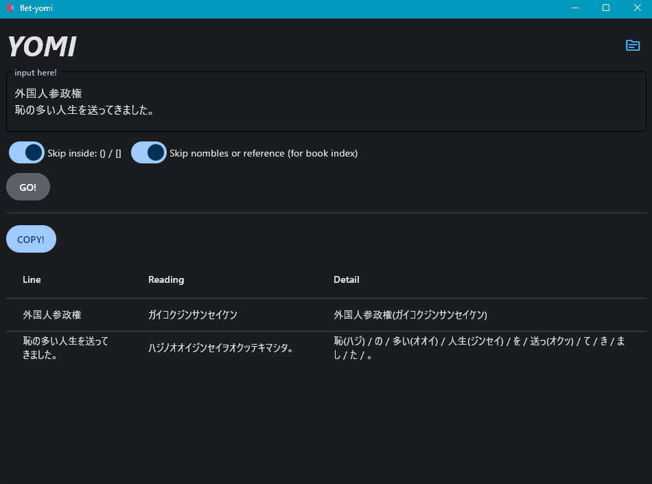

# Get Japanese reading with [SudachiPy](https://github.com/WorksApplications/SudachiPy)



## Build

1. Install SudachiPy, SudachiDict-core, PyInstaller:

    ```
    pip install sudachipy sudachidict_core pyinstaller
    ```

1. Find `sudachipy` and `sudachidict_core` folder inside Python site-package folder and copy them into `assets` folder.

    ```
    .\
    │  main.py
    │  sudachi.py
    │
    └─assets
        ├─sudachidict_core
        │  └─...
        │
        └─sudachipy
            └─...
    ```

1. Run below command.
    + Use `pyinstaller` command insread of `flet pack` because `flet` command does not accept multiple `--add-data`.

    ```
    pyinstaller --onefile --name yomi --add-data assets\sudachidict_core;sudachidict_core --add-data assets\sudachipy;sudachipy --noconsole main.py
    ```